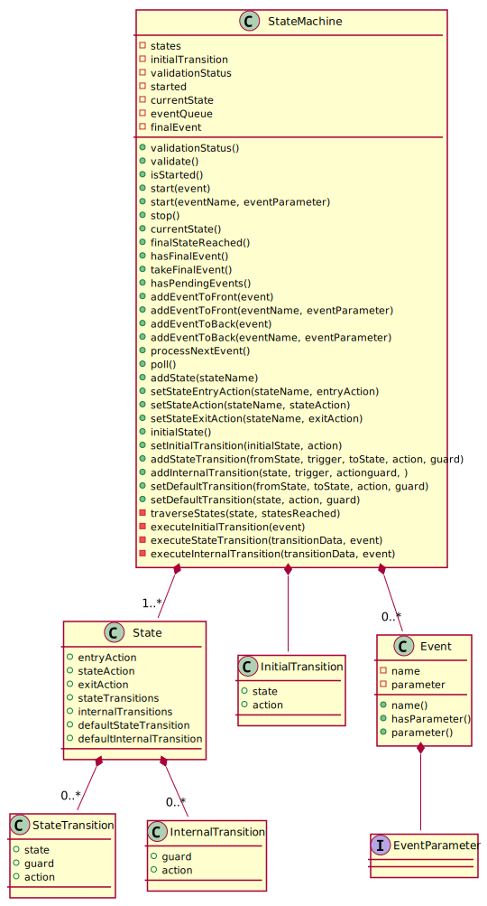
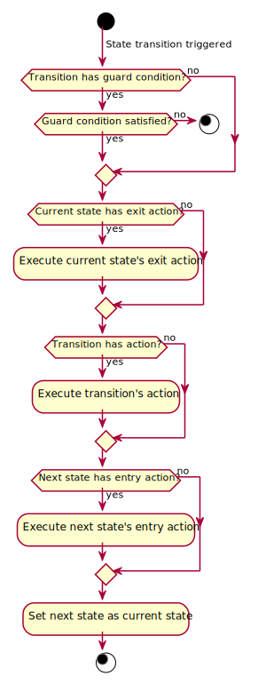

# Design

The state machine shall be divided into the following segments:

* Configuration
* Validation
* Event processing
* Startup procedure
* Shutdown procedure

## Configuration

The state machine shall be configured by:

* adding states
* setting entry and/or exit actions to states (optional)
* setting the initial transition
* adding state and/or internal transitions to states (optional)
* setting default state or internal transition to states (optional)

### State machine states

The state machine shall have a container for all of its states. It shall be possible to add states
but not to remove or rename them.

When a state is added it shall be possible to set also its optional entry and/or exit action.

A state shall have:

* a name
* an entry action (optional)
* an exit action (optional)
* state transitions (optional)
* internal transitions (optional)
* default state or internal transition (optional)

### Initial transition

A valid state machine shall need to have its initial transition set. The initial transition shall
need to know to which state to transition to during startup and optionally it shall be possible to
set an action for the transition.

### State transitions

It shall be possible to add state transitions to a state. A state transition shall have:

* a trigger (name of the event that triggers the transition)
* a state to transition to
* a guard condition (optional)
* an action (optional)

### Internal transitions

It shall be possible to add internal transitions to a state. An internal transition shall have:

* a trigger (name of the event that triggers the transition)
* a guard condition (optional)
* an action

### Default transition

It shall be possible to set a single state or internal transition (but not both!) that shall be
executed only in case the event that is being processes does not trigger any of the state and
internal transitions.

### Final states

If a state has no state, internal, nor default transitions it shall be treated as a final state. A
final state can have an entry action, but not an exit action.

It shall be possible to have zero or more final states in a state machine.

## Validation

A state machine shall be valid if:

* it has at least one state
* the initial transition is set
* all state transitions reference existing states
* all internal transitions have actions
* all state and internal transitions have a valid trigger (non-empty event name)
* at most one of the default transitions (state or internal) is set in each state
* final states do not have their exit action set
* all states of the state machine can be reached

The validation shall be done as soon as it makes sense:

* on adding a state the state's name shall be checked if it's empty or if a state with the same name
  already exists
* on setting the initial transition the initial state shall reference an existing state
* on adding a state transition the trigger name shall be checked if it's empty and if the referenced
  states exist
* on adding an internal transition the trigger name shall be checked if it's empty and if the action
  was provided
* everything else shall be checked with the validation procedure

## Event processing

It shall be possible to add events to the state machine's event queue, either to the front (next
pending event) or the back (last pending event), but only if the state machine is started. It shall
be possible to query if there is at least one pending event in the event queue.

The events shall not be processed immediately, event processing shall need to be triggered
explicitly by the user of the state machine.

Events shall be processed one at a time by taking the next pending event from the event queue and
using it to trigger a transition if possible. The event is available and passed to all guard
conditions and transition and state actions that are executed during the complete transition
workflow.

The startup procedure (initial transition) and event processing (state transitions) shall be the
only ways to change the state of the state machine.

Events shall be processed using the following workflows:

## Startup procedure

TODO

## Shutdown procedure

TODO
