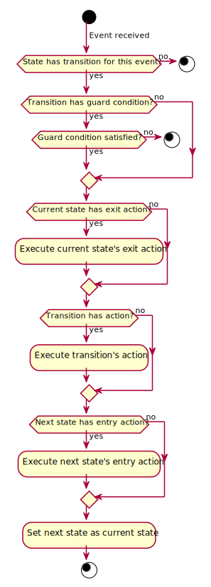

# Requirements

## [R1] Event-driven state machine

State machine shall be event-driven. This means that any changes in the state machine state or
execution of any actions shall be triggered by an event.

## [R1.1] Event

An event shall have the following properties:

* a name (shall not be empty)
* an optional event specific data structure

## [R1.2] Event queue

It shall be possible to add events to the state machine's event queue, either to the front (next
pending event) or the back (last pending event).

The events shall not be processed immediately, event processing shall need to be triggered
explicitly.

## [R1.3] Processing of events

Processing of events shall be triggered by the user of the state machine. Events shall be processed
one at a time and in the same order as they were added to the event queue (i.e. run-to-completion
execution model).

The reason for this requirement is to prevent processing of an event while another event is still
being processed. This could occur if:

* multiple events are generated at the same time
* multiple threads generate events at the same time (or in a short time range)
* events are generated as a result of the current event being processed (events can be generated by
  state entry and exit actions, transition guard conditions and actions)

## [R2] State machine state

A state machine state shall have the following properties:

* a name (shall not be empty)
* an entry action (optional)
* an exit action (optional)
* state transitions
* internal transitions

A state machine shall have at least one state.

## [R2.1] Entry action

An entry action shall be executed on entry to the state and it shall have the following context when
executed:

* event that triggered the transition to the state
* name of the current state
* name of the previous state

## [R2.2] Exit action

An exit action shall be executed on exit from the state and it shall have the following context when
executed:

* event that triggered the transition from the state
* name of the current state
* name of the next state

## [R2.3] State transition

A state transition shall have the following properties:

* name of the event that triggers the transition
* name of the state to transition to
* a guard condition (optional)
* an action (optional)

A state transition shall be executed on a specific event but only if its guard condition is
satisfied. In that case the current state's exit action is executed, followed by the transition's
action, and finally the next state's entry action.

## [R2.3.1] State transition's guard condition

A guard condition shall have the following context when executed:

* event that triggered the transition
* name of the current state
* name of the next state

The result of executing a guard condition shall be whether the condition was satisfied or not.

## [R2.3.2] State transition's action

An action shall have the following context when executed:

* event that triggered the transition
* name of the current state
* name of the next state

## [R2.3.3] State self-transition

A self-transition occurs when a transition is made from a state back to the same state. In this case
the state machine shall still execute the state's exit and entry actions. Execution of these action
can be prevented by the use of an *internal transition*.

## [R2.4] Internal transition

An internal transition shall have the following properties:

* name of the event that triggers the transition
* a guard condition (optional)
* an action

An internal transition shall be executed on a specific event but only if its guard condition is
satisfied. In that case the transition's action shall be executed.

## [R3] Initial state machine state

It shall be possible to specify that a specific one state machine state shall be the initial state.
It shall be the state to which the state machine shall transition to when the state machine is
started.

## [R4] Final state machine state

All state machine states that shall have no transitions to other state shall be treated as final
states. When one of these states is reached the state machine shall be stopped.

Since the final state can only be entered it shall not be possible to set an exit action or internal
transitions to a final state.

It shall be possible to setup a state machine with no final states. That kind of a state machine can
only be stopped by the user.

## [R5] State machine validation

It shall be possible to validate if the definition of states and transitions is valid.

The validation procedure shall validate that:

* the initial state is set
* all state transitions reference existing states
* final states have no exit action nor any internal transitions
* all each state of the state machine can be reached

## [R6] Startup procedure

To start the state machine the user shall have to provide an initial event so that it can be used to
transition to the initial state.

As with any other state the entry action of the initial state shall be executed on startup with the
provided startup event.

## [R7] Shutdown procedure

The user shall be able to stop the state machine at any time

The state machine shall also be shutdown automatically on entering one of the final states.
