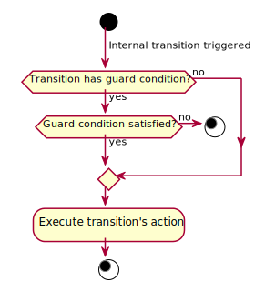

# Requirements

## [R1] Event-driven state machine

State machine shall be event-driven. This means that any changes in the state machine state or
execution of any actions shall be triggered by an event.

## [R1.1] Event

An event shall have the following properties:

* a name (shall not be empty)
* an optional parameter

## [R1.2] Event queue

It shall be possible to add events to the state machine's event queue, either to the front (next
pending event) or the back (last pending event).

The events shall not be processed immediately, event processing shall need to be triggered
explicitly.

The main reason for the possibility to add events to the front of the event queue is to make it
possible to:

* propagate events to next states
* prevent losing queued events just because the next state might need some specific events before it
  it is able to process the queued events
* have finer control over the behavior of the state machine

## [R1.3] Processing of events

Processing of events shall be triggered by the user of the state machine. Events shall be processed
one at a time and in the same order as they are in the event queue (i.e. run-to-completion
execution model).

The reason for this requirement is to prevent processing of an event while another event is still
being processed. This could occur if:

* multiple events are generated at the same time
* multiple threads generate events at the same time (or in a short time range)
* events are generated as a result of the current event being processed (events can be generated by
  state entry and exit actions, transition guard conditions and actions)

## [R2] Polled state machine

It shall be possible for the user of the state machine to trigger an action in a state machine state
at any time. This is an optional feature of the state machine.

The state machine shall process all pending events before the state action is executed.

*Note: The state machine state shall not be directly controllable with polling as the only way to
change the state machine state shall still be exclusive responsibility of event processing, but a
state action could generate events that would result in change of the state machine state.*

*Rationale: This shall improve performance of use-cases like file parsers where unnecessary events
would have to be generated to signal that a byte or a line was read from the file. It also gives the
user more possibilities for designing the state machine.*

## [R3] State machine state

A state machine state shall have the following properties:

* a name (shall not be empty)
* an entry action (optional)
* a state action (optional)
* an exit action (optional)
* state transitions
* internal transitions
* optional default state or internal transition

A state machine shall have at least one state.

## [R3.1] Entry action

An entry action shall be executed on entry to the state and it shall have the following context when
executed:

* event that triggered the transition to the state
* name of the current state
* name of the previous state

## [R3.2] State action

A state action shall be executed when the state machine is polled and it shall have the following
context when executed:

* name of the current state

## [R3.3] Exit action

An exit action shall be executed on exit from the state and it shall have the following context when
executed:

* event that triggered the transition from the state
* name of the current state
* name of the next state

## [R3.4] Transitions

There shall be two types of transitions:

* state
* internal

A state shall have zero or more state and/or internal transitions, but it shall not be possible to
trigger both types of transition with the same event.

It shall be possible for a state to also have a single default transition of one or the other type.

Workflow for executing transitions:

## [R3.4.1] State transition

A state transition shall have the following properties:

* name of the event that triggers the transition
* name of the state to transition to
* a guard condition (optional)
* an action (optional)

A state transition shall be executed on a specific event but only if its guard condition is
satisfied. In that case the current state's exit action is executed, followed by the transition's
action, and finally the next state's entry action.

If a state transitions back to itself than that is considered to be a self-transition which shall behave exactly the same as a normal state transition - the state machine shall still execute the
state's exit and entry actions. If execution of these actions is not wanted than an internal
transition should be used instead.

Workflow for executing state transitions:

## [R3.4.1.1] State transition's guard condition

A state transition's guard condition shall have the following context when executed:

* event that triggered the transition
* name of the current state
* name of the next state

The result of executing a guard condition shall be whether the condition was satisfied or not.

## [R3.4.1.2] State transition's action

A state transition's action shall have the following context when executed:

* event that triggered the transition
* name of the current state
* name of the next state

## [R3.4.2] Internal transition

An internal transition shall have the following properties:

* name of the event that triggers the transition
* a guard condition (optional)
* an action

An internal transition shall be executed on a specific event but only if its guard condition is
satisfied. In that case the transition's action shall be executed.

Workflow for executing internal transitions:

## [R3.4.2.1] Internal transition's guard condition

An internal transition's guard condition shall have the following context when executed:

* event that triggered the transition
* name of the current state

The result of executing a guard condition shall be whether the condition was satisfied or not.

## [R3.4.2.2] Internal transition's action

An internal transition's action shall have the following context when executed:

* event that triggered the transition
* name of the current state

## [R3.4.3] Default transition

It shall be possible to set a default transition that shall be executed only in case the event that
is being processes does not trigger any of the state and internal transitions. The default
transition shall not be executed if a state or internal transition is triggered but blocked by its
guard condition.

Workflow for executing default transitions shall be the same as with its non-default counterpart (an
ordinary state or internal transition).

## [R4] Initial state machine state

It shall be possible to specify that a specific one state machine state shall be the initial state.
It shall be the state to which the state machine shall transition to when the state machine is
started.

## [R5] Initial transition

On startup the state machine transitions to the initial state with the specific event provided by
the user when the state machine was started.

It shall be possible to set an action to be executed during this transition.

The initial transition's action shall have the following context when executed:

* event that triggered the transition
* name of the initial state

## [R6] Final state machine state

All state machine states that shall have no transitions to other state shall be treated as final
states. When one of these states is reached the state machine shall be stopped and the event that
triggered the transition shall be stored.

Since the final state can only be entered it shall not be possible to set an exit action or internal
transitions to a final state.

It shall be possible to setup a state machine with no final states. That kind of a state machine can
only be stopped by the user.

## [R7] State machine validation

It shall be possible to validate if the definition of states and transitions is valid.

The validation procedure shall validate that:

* the initial transition is set
* all state transitions reference existing states
* final states have no exit action nor any internal transitions
* all states of the state machine can be reached

## [R8] Startup procedure

To start the state machine the user shall have to provide an initial event so that it can be used to
execute the initial transition to the initial state.

As with any other state the entry action of the initial state shall be executed on startup with the
provided startup event.

Workflow for executing the initial transition:

## [R9] Shutdown procedure

The user shall be able to stop the state machine at any time.

The state machine shall also be shutdown automatically on entering one of the final states:

